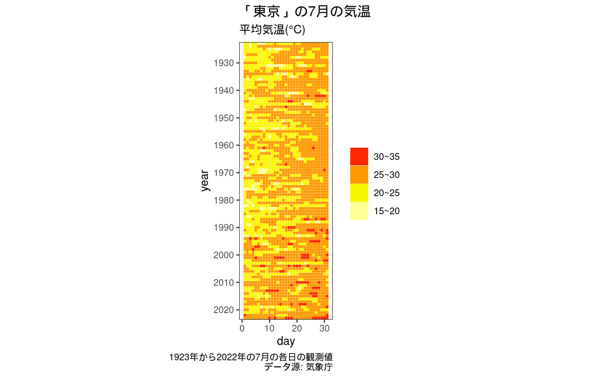
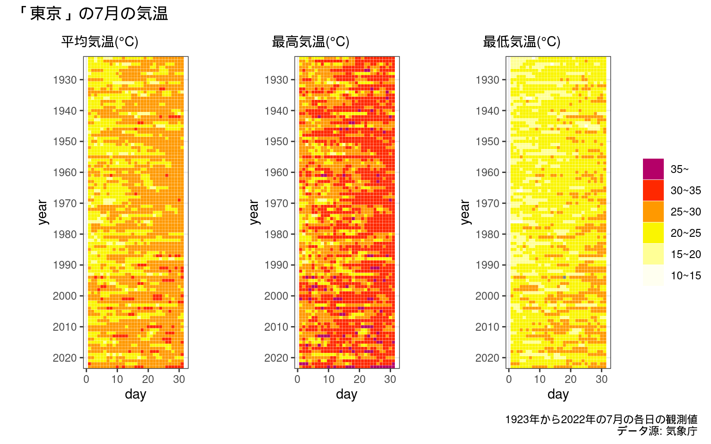

``` r
if (!require("pacman")) install.packages("pacman")
```

    Loading required package: pacman

``` r
pacman::p_load(
  jmastats,
  tidyverse,
  units,
  patchwork
)
theme_set(theme_bw()) # ggplot2のテーマ指定

stations |>
  filter(station_name == "東京") |>
  distinct(block_no)
```

    # A tibble: 1 × 1
      block_no
      <chr>   
    1 47662   

``` r
df_tksm <-
  # year引数に与えられる年を指定 ... 1923年から2022年まで
  seq.int(1923, 2023) |>
  purrr::set_names() |>
  purrr::map(
    \(x) jma_collect(item = "daily",
                     block_no = "47662",
                     year = x,
                     month = 7)) |>
  # 一つのデータフレームにまとめる
  # 取得を行った年をyear変数に記録する
  purrr::list_rbind(names_to = "year")


glimpse(df_tksm)
```

    Rows: 3,131
    Columns: 10
    $ year          <chr> "1923", "1923", "1923", "1923", "1923", "1923", "1923", …
    $ date          <date> 1923-07-01, 1923-07-02, 1923-07-03, 1923-07-04, 1923-07…
    $ pressure      <tibble[,2]> <tbl_df[26 x 2]>
    $ precipitation <tibble[,3]> <tbl_df[26 x 3]>
    $ temperature   <tibble[,3]> <tbl_df[26 x 3]>
    $ humidity      <tibble[,2]> <tbl_df[26 x 2]>
    $ wind          <tibble[,5]> <tbl_df[26 x 5]>
    $ sunshine      <tibble[,1]> <tbl_df[26 x 1]>
    $ snow          <tibble[,2]> <tbl_df[26 x 2]>
    $ weather_time  <tibble[,2]> <tbl_df[26 x 2]>

``` r
df_tksm <-
  df_tksm |>
  # 日付と気温についての変数を選択
  select(year,
         date,
         temperature) |>
  # ネストされたデータフレームを展開する
  tidyr::unnest(cols = temperature)

glimpse(df_tksm)
```

    Rows: 3,131
    Columns: 5
    $ year         <chr> "1923", "1923", "1923", "1923", "1923", "1923", "1923", "…
    $ date         <date> 1923-07-01, 1923-07-02, 1923-07-03, 1923-07-04, 1923-07-…
    $ `average(℃)` <dbl> 20.0, 20.0, 19.9, 22.4, 21.0, 19.2, 18.5, 19.5, 22.2, 23.…
    $ `max(℃)`     <dbl> 22.1, 23.2, 23.8, 27.9, 23.4, 24.9, 21.6, 23.6, 26.8, 27.…
    $ `min(℃)`     <dbl> 18.5, 18.0, 17.0, 16.2, 17.3, 15.4, 15.8, 14.7, 19.7, 20.…

``` r
df_tksm <-
  df_tksm |>
  #　変数名から単位を取り除き、変数の値を対応するunitsオブジェクトに変換
  parse_unit()
```

    New names:
    • `` -> `...1`
    • `` -> `...2`
    • `` -> `...3`

``` r
glimpse(df_tksm)
```

    Rows: 3,131
    Columns: 5
    $ year    <chr> "1923", "1923", "1923", "1923", "1923", "1923", "1923", "1923"…
    $ date    <date> 1923-07-01, 1923-07-02, 1923-07-03, 1923-07-04, 1923-07-05, 1…
    $ average [°C] 20.0 [°C], 20.0 [°C], 19.9 [°C], 22.4 [°C], 21.0 [°C], 19.2 [°C…
    $ max     [°C] 22.1 [°C], 23.2 [°C], 23.8 [°C], 27.9 [°C], 23.4 [°C], 24.9 [°C…
    $ min     [°C] 18.5 [°C], 18.0 [°C], 17.0 [°C], 16.2 [°C], 17.3 [°C], 15.4 [°C…

``` r
df_tksm <- 
  df_tksm |>
  mutate(year = as.integer(year),
         day = lubridate::day(date))

plot_temp_hm <- function(data, var, ...) {
  pal_relative <-
    jmastats:::jma_pal(palette = "relative", .attribute = TRUE)
  data |>
    mutate(year = forcats::fct_rev(as.character(year)),
           {{ var }} := drop_units({{ var }})) |>
    mutate(z = case_when(
      {{ var }} >= 35 ~ "35~",
      between({{ var }}, 30, 35) ~ "30~35",
      between({{ var }}, 25, 30) ~ "25~30",
      between({{ var }}, 20, 25) ~ "20~25",
      between({{ var }}, 15, 20) ~ "15~20",
      between({{ var }}, 10, 15) ~ "10~15",
      between({{ var }},  5, 10) ~ "5~10",
      between({{ var }},  0,  5) ~ "0~5",
      between({{ var }}, -5,  0) ~ "-5~0",
      .default = as.character({{ var }})
    )) |>
    ggplot() +
    aes(day, y = year, fill = z) +
    geom_tile(color = "white", linewidth = 0.05, ...) +
    coord_equal() +
    scale_fill_manual(values = rev(pal_relative$colors |>
                                     purrr::set_names(pal_relative$amedas$labels)),
                      drop = TRUE) +
    scale_y_discrete(breaks = as.character(seq.int(1920, 2020, by = 10))) +
    guides(fill = guide_legend(title = NULL,
                               reverse = TRUE))
}

p1_ave <- 
  plot_temp_hm(df_tksm, average, show.legend = TRUE)

p1_ave +
  labs(title = "「東京」の7月の気温",
       subtitle = str_glue("平均気温({intToUtf8(c(176, 67))})"),
       caption = "1923年から2022年の7月の各日の観測値\nデータ源: 気象庁")
```



``` r
p1_ave <- 
  plot_temp_hm(df_tksm, average, show.legend = FALSE) +
  labs(subtitle = str_glue("平均気温({intToUtf8(c(176, 67))})"))
p2_max <-
  plot_temp_hm(df_tksm, max, show.legend = FALSE) +
  labs(subtitle = str_glue("最高気温({intToUtf8(c(176, 67))})"))
p3_min <-
  plot_temp_hm(df_tksm, min, show.legend = FALSE) +
  labs(subtitle = str_glue("最低気温({intToUtf8(c(176, 67))})"))


pal_relative <-
  jmastats:::jma_pal(palette = "relative", .attribute = TRUE)

p_legend <-
  df_tksm |>
  tidyr::pivot_longer(cols = c(average, min, max)) |>
  mutate(value = drop_units(value)) |>
  mutate(z = case_when(
    value >= 35 ~ "35~",
    between(value, 30, 35) ~ "30~35",
    between(value, 25, 30) ~ "25~30",
    between(value, 20, 25) ~ "20~25",
    between(value, 15, 20) ~ "15~20",
    between(value, 10, 15) ~ "10~15",
    between(value,  5, 10) ~ "05~10",
    between(value,  0,  5) ~ "00~05",
    between(value, -5,  0) ~ "-5~00",
    .default = as.character(value)
  )) |>
  filter(!is.na(z)) |>
  ggplot() +
  aes(day, value, fill = z) +
  geom_tile() +
  scale_fill_manual(values = rev(pal_relative$colors |>
                                   purrr::set_names(pal_relative$amedas$labels)),
                    drop = TRUE) +
  guides(fill = guide_legend(title = NULL,
                             reverse = TRUE))

p_legend <- cowplot::get_legend(p_legend)


p1_ave + p2_max + p3_min +
  p_legend +
  plot_layout(widths = c(0.3, 0.3, 0.3, 0.1), ncol = 4, guides = "auto") +
  plot_annotation(title = "「東京」の7月の気温",
                  caption = "1923年から2022年の7月の各日の観測値\nデータ源: 気象庁")
```


