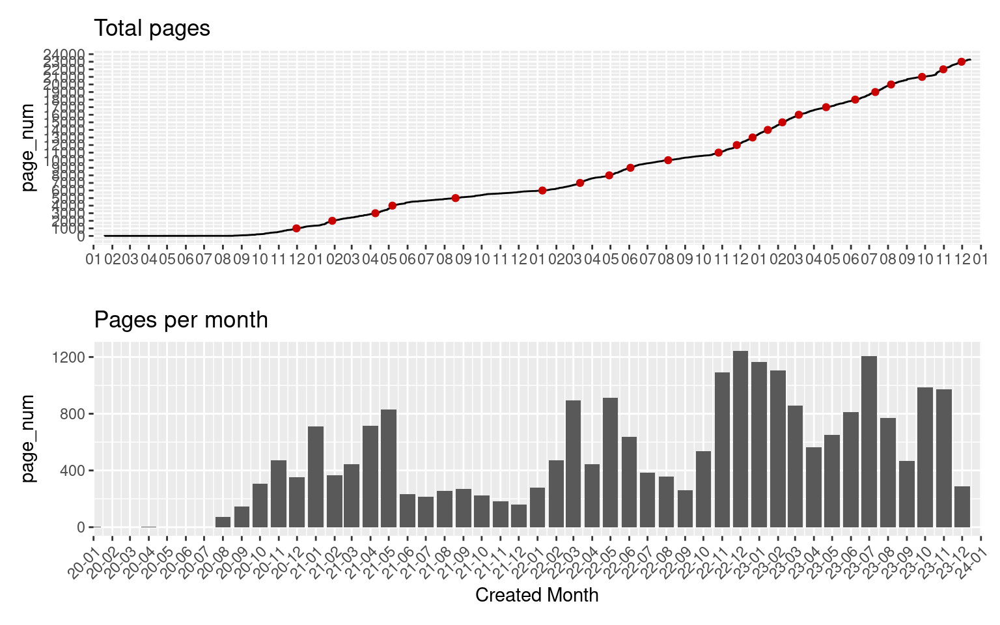

``` r
if (!require("pacman")) install.packages("pacman")
```

    Loading required package: pacman

``` r
pacman::p_load(
  tidyverse,
  jsonlite,
  lubridate,
  ggpubr,
  patchwork
)
as_datetime(1500000000, tz = "Asia/Tokyo")
```

    [1] "2017-07-14 11:40:00 JST"

``` r
# Get Stats
df <-
  fromJSON(
    "https://raw.githubusercontent.com/meganii/sandbox-github-actions-scheduler/main/villagepump/stats/pages.json"
  ) %>%
  as_tibble %>%
  tibble::rownames_to_column("page_num") %>%
  unnest_wider(pages) %>% 
  mutate(created = as.Date(as_datetime(created)),
         updated = as.Date(as_datetime(updated)),
         page_num = as.numeric(page_num))


weekly_counts <- df %>% 
  mutate(week = floor_date(created, unit = "week")) %>% 
  count(week) %>% 
  complete(
    week = seq.Date(
      from = min(week, na.rm=T),
      to = max(week, na.rm=T),
      by = "week"),
    fill = list(n = 0))
weekly_counts
```

    # A tibble: 202 × 2
       week           n
       <date>     <int>
     1 2020-01-19     5
     2 2020-01-26     0
     3 2020-02-02     0
     4 2020-02-09     0
     5 2020-02-16     0
     6 2020-02-23     0
     7 2020-03-01     0
     8 2020-03-08     0
     9 2020-03-15     0
    10 2020-03-22     0
    # ℹ 192 more rows

``` r
month_counts <- df %>% 
  mutate(month = floor_date(created, unit = "month")) %>% 
  count(month) %>% 
  complete(
    month = seq.Date(
      from = min(month, na.rm=T),
      to = max(month, na.rm=T),
      by = "month"),
    fill = list(n = 0))
month_counts
```

    # A tibble: 48 × 2
       month          n
       <date>     <int>
     1 2020-01-01     5
     2 2020-02-01     0
     3 2020-03-01     0
     4 2020-04-01     5
     5 2020-05-01     0
     6 2020-06-01     0
     7 2020-07-01     1
     8 2020-08-01    71
     9 2020-09-01   144
    10 2020-10-01   307
    # ℹ 38 more rows

``` r
# Calc diff
page_unit <- 1000
df2 <- df %>%
  filter(page_num %% page_unit == 0) %>%
  mutate(
    prev_val = dplyr::if_else(is.na(lag(created)), as.Date('2020-01-19'), lag(created)),
    days = as.numeric(ymd(created) - ymd(prev_val)),
    "Δpages/days" = round(page_unit / days, 1)
  ) %>% 
  select(1, 6, 9:10)
df2
```

    # A tibble: 23 × 4
       page_num created    descriptions prev_val  
          <dbl> <date>     <list<list>> <date>    
     1     1000 2020-11-30          [1] 2020-01-19
     2     2000 2021-01-28          [1] 2020-11-30
     3     3000 2021-04-09          [1] 2021-01-28
     4     4000 2021-05-07          [1] 2021-04-09
     5     5000 2021-08-19          [1] 2021-05-07
     6     6000 2022-01-09          [1] 2021-08-19
     7     7000 2022-03-12          [1] 2022-01-09
     8     8000 2022-04-29          [1] 2022-03-12
     9     9000 2022-06-03          [1] 2022-04-29
    10    10000 2022-08-04          [1] 2022-06-03
    # ℹ 13 more rows

``` r
# Created pages by Month
Grid_Fig2 <- ggplot(month_counts, aes(month, n)) +
  geom_bar(stat="identity") + 
  scale_x_date(
    expand = c(0,0),             # 両端の余分なスペースを削除
    # 1ヶ月ごとに軸ラベルを表示する
    date_breaks = "1 months",
    # 月・日をラベルとして表示する
    date_labels = "%y-%m"
  ) +
  theme(axis.text.x = element_text(angle=45, hjust=1)) +
  labs(title = "Pages per month") +
  xlab("Created Month") +
  ylab("page_num")

Grid_Fig1 <- ggplot(df, aes(created, page_num)) +
  geom_line() +
  geom_point(data= df2, aes(x = created, y = page_num), colour = "red3") +
  scale_y_continuous(breaks = seq(from=0, to=max(df2$page_num)+1000, by=1000)) +
  scale_x_date(
    expand = c(0,0),            # 両端の余分なスペースを削除
    date_breaks = "1 month",    # 1ヶ月ごとに軸ラベルを表示する
    date_labels = "%m"          # 月をラベルとして表示する
  ) + 
  xlab("") +
  labs(title = "Total pages")

min_month <- min(month_counts$month)
max_month <- max(month_counts$month) + months(1)
xlimits <- coord_cartesian(xlim = c(min_month, max_month)) # xlim() はNG
p <- wrap_plots(Grid_Fig1 + xlimits, Grid_Fig2 + xlimits, nrow = 2)

## Save to png
p
```


